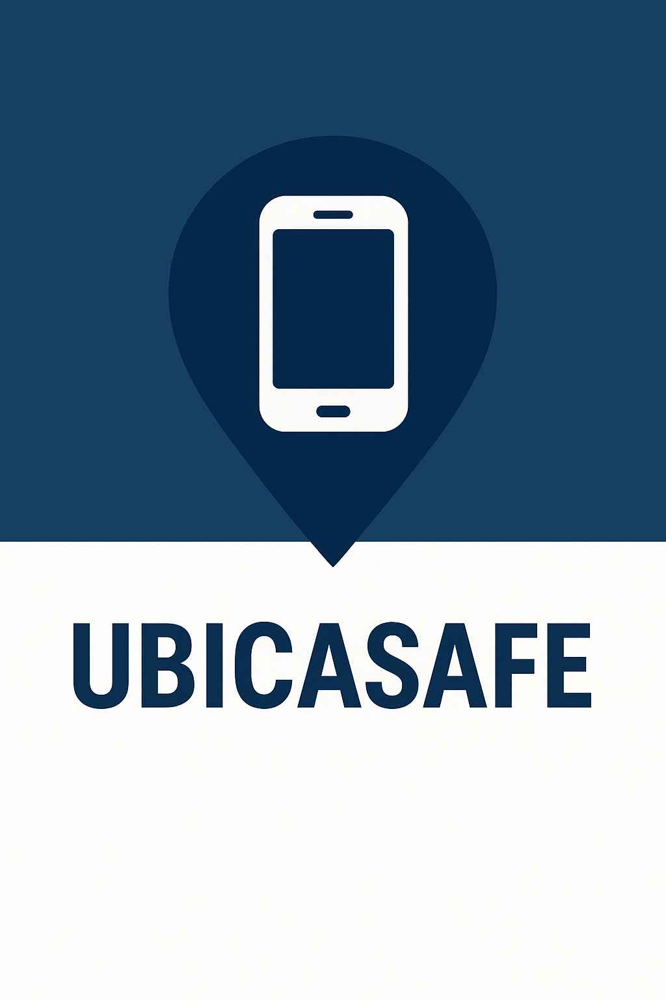
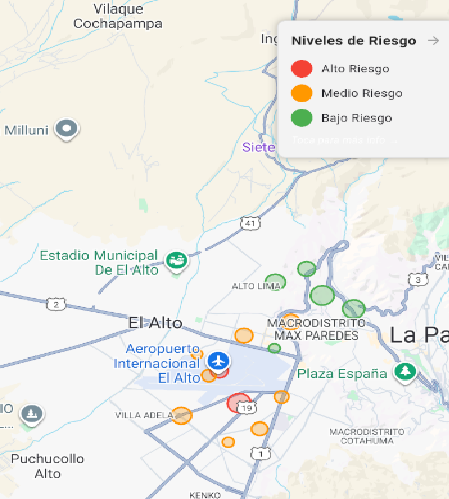
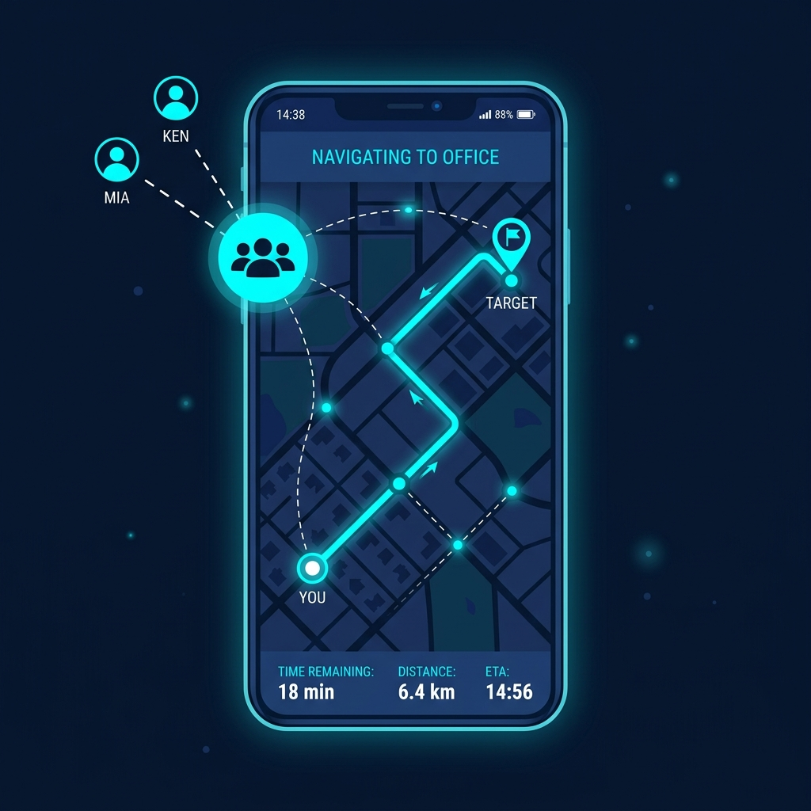
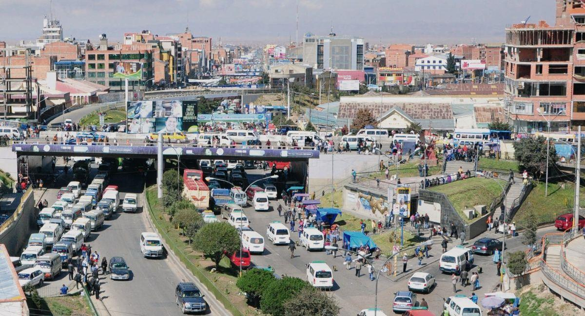

# UbicaSafe

Aplicacion movil para prevencion ciudadana en El Alto y La Paz. UbicaSafe combina mapas de riesgo, ubicacion en tiempo real, reportes, recomendaciones de autoproteccion y asistencia conversacional con IA para ayudar a tomar mejores decisiones al desplazarse por la ciudad.

<p align="center">
  
</p>

## Vista Rapida

| Portada | Onboarding | Mapa de Riesgo |
|---|---|---|
|  |  |  |

| Wara IA | Recomendaciones | Zonas |
|---|---|---|
|  |  |  |

## Funcionalidades

- **Mapa de riesgo con OpenStreetMap**: visualizacion de zonas peligrosas, radios de riesgo y limites de El Alto sin depender de una API key de Google Maps.
- **Mi ubicacion en tiempo real**: seguimiento de ubicacion con avatar personalizado, puntos de riesgo visibles y boton para recentrar el mapa.
- **Mapa predictivo**: vista orientada a la prevencion con indicadores, recomendaciones y acceso a zonas de mayor incidencia.
- **Reportes ciudadanos**: flujo para registrar incidentes y fortalecer la base de informacion de riesgo.
- **Asistente Wara**: experiencia conversacional con voz/texto para orientar al usuario en temas de seguridad.
- **Contenido preventivo**: videos, recomendaciones y recursos de autoproteccion.
- **Perfil y configuracion**: gestion basica del usuario y preferencias de la app.

## Stack Tecnico

- **Framework**: Flutter / Dart
- **Mapas**: `flutter_map`, `latlong2`, OpenStreetMap tiles
- **Ubicacion**: `geolocator`, `permission_handler`
- **Autenticacion**: Firebase Auth, Google Sign-In
- **IA y voz**: servicios Gemini, audio en vivo, STT/TTS
- **Multimedia**: `video_player`, `chewie`, assets locales
- **Backend/API**: `http` y servicios propios en `lib/services`

## Estructura Principal

```text
lib/
  core/                 Tema visual y utilidades compartidas
  data/                 Zonas de riesgo locales y calculos geograficos
  pages/                Pantallas principales de la aplicacion
  services/             API, autenticacion, Gemini, voz y audio
  widgets/              Componentes reutilizables

assets/
  icons/                Avatares, iconos y escudo de la app
  img/                  Imagenes de portada, zonas y recomendaciones
  videos/               Material preventivo
  sounds/               Alertas sonoras
```

## Instalacion Local

1. Clona el repositorio:

```bash
git clone https://github.com/mrlalo7/ubicasafe-vps.git
cd ubicasafe-vps
```

2. Instala dependencias:

```bash
flutter pub get
```

3. Ejecuta la app:

```bash
flutter run
```

Para probar en navegador:

```bash
flutter run -d chrome
```

## Configuracion Necesaria

La app puede abrir y mostrar mapas con OpenStreetMap sin API key de Google. Para el funcionamiento completo revisa:

- **Permisos Android**: ubicacion e internet en `android/app/src/main/AndroidManifest.xml`.
- **Firebase**: agrega/configura `google-services.json` si vas a usar autenticacion Firebase.
- **Backend**: revisa las URL y endpoints usados por `lib/services/api_service.dart`.
- **IA/voz**: configura las credenciales/servicios externos usados por Gemini, STT/TTS o audio en vivo segun el entorno.

## Mapas Sin API Key

UbicaSafe usa `flutter_map` con tiles de OpenStreetMap para evitar bloqueos por restricciones de API key. Las pantallas principales de mapa son:

- `lib/pages/menu.dart`
- `lib/pages/mapariesgo.dart`
- `lib/pages/ubicaciontiemporeal.dart`

Para produccion, se recomienda usar un proveedor de tiles con terminos adecuados para alto trafico o desplegar un servidor propio de tiles.

## Comandos Utiles

```bash
flutter analyze --no-fatal-warnings --no-fatal-infos
flutter pub outdated
flutter clean && flutter pub get
```

## Contexto

UbicaSafe nace como una propuesta para aplicar IA, geolocalizacion y datos comunitarios a la prevencion de inseguridad ciudadana en Bolivia. El proyecto busca ser accesible, practico y culturalmente cercano, integrando experiencias conversacionales como Wara y recursos preventivos para usuarios de distintas edades y contextos.

